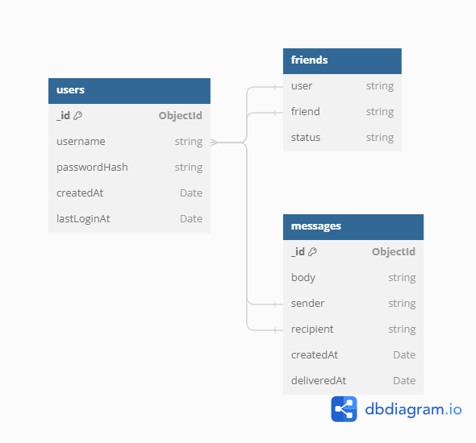

# Java messaging app

This is a small messaging app written in Java. It uses a Spring Boot backend and will have multiple frontends in the future, including a Java CLI client, Java Swing client and a web client.
It is currently a work in progress, but I am planning to keep working on it to showcase my skills and learn new things. An approximate roadmap is in ```TODO.md```. 

## Running the app

### GUI
The Swing GUI is functional to send and receive messages using this service. To run the GUI version, run the ```message_client.MessageClientGUI``` class. The GUI is written in Java Swing. I am not a designer, so it is very ugly. This is not for lack of knowledge, but for lack of creativity. Sorry about that :). 

### Command-line version
The app was written in Java 20.0, so compatibility with lower Java versions is not guaranteed. To run the application, simply run the ```message_client.MessageClientCLI``` class. The command-line interface will let you interact with the app. For a list of commands, type 'help'. 
This interface is quite crude, but it has full functionality and allows one to use the messaging service. 

## Backend
The message server code can be found in the group.message_server package. The server is a Spring Boot application that uses a MongoDB database to store messages and users. The server is currently deployed on a Google Cloud VM since this is just a small demo. The server is running on port 8081.

## Database schema


The database runs in MongoDB due to ease of use relative to SQL-based databases. This is not because I don't know how to use SQL based databases, but purely due to the simplicity of the task at hand. The database schema is shown above.  
The three collections contain all the necessary data for the server to run the messaging application. There are better ways to implement this database for heavier workloads and large amounts of data, but this serves fine for a small-scale deployment. 